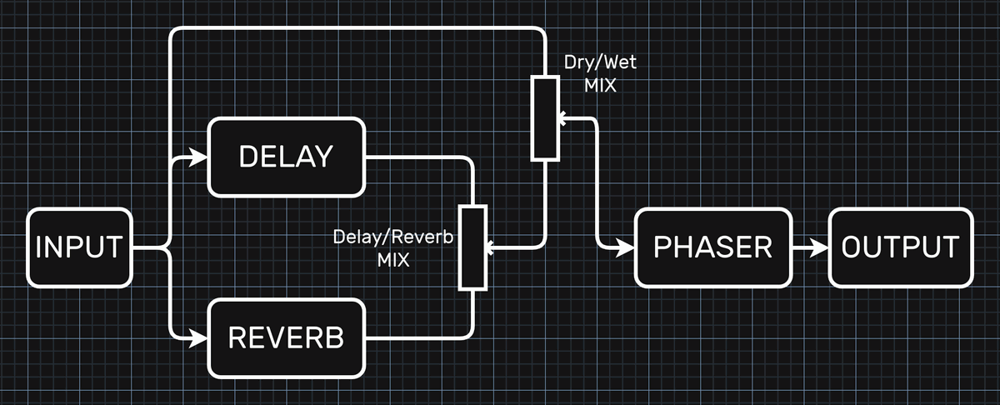

# Teensy40-FX-Module
## Effect module using T40 and HexeFX effect library  

example effect module utiliusing Teensy4.0 and hexefx_audiolib_i16 developed for the [Degenerator Sampler project by Rolf Degen](https://forum.pjrc.com/index.php?threads/new-polyhonic-teensy-diy-sampler.76219/).  

PlatformIO project  

## Signal structure:  

## Control interface  
Open in Chrome or Edge (required WebMIDI and WebSerial)  
### [LINK](https://hexeguitar.github.io/Teensy40-FX-Module/html/T40_FXmodule.html "T40 FX module Control Interface") 
---  
(c) 2025 by Piotr Zapart  
www.hexefx.com  